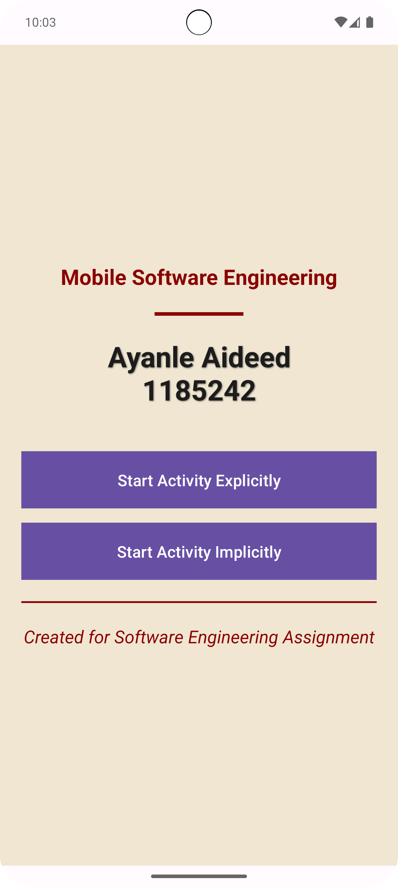
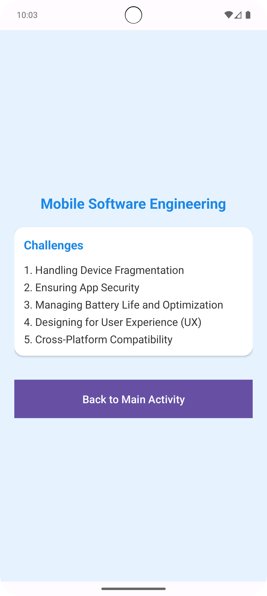
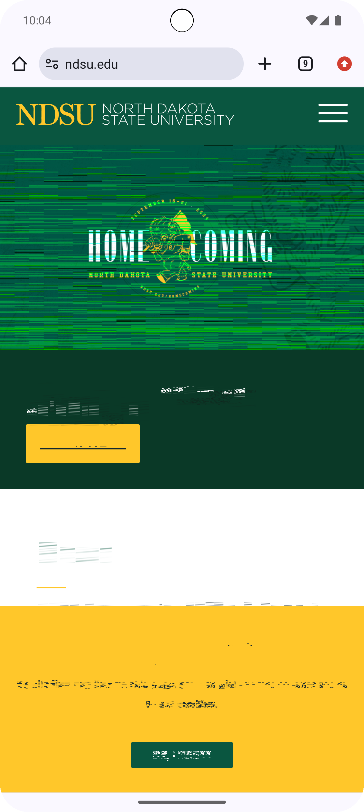

# My-First-Mobile-App
Assignment 2 Creating a basic kotlin mobile app With implicit and explicit command/Actions

# Here are some screenshots of the app:

# Android App Assignment

This app demonstrates two activities in Android with explicit and implicit intents.

## Features
- Main activity displays full name and student ID.
- Two buttons on the main activity:
  - **Explicit Intent**: Opens a second activity listing five mobile software engineering challenges.
  - **Implicit Intent**: Opens the Android Developer website.
- Second activity includes a button to return to the main activity.

## Device/Emulator Used
- Pixel 8 pro Emulator
- Android 14,  (API 35)

## How to Run
1. Clone this repository.
2. Open the project in Android Studio.
3. Run the app on an emulator or real device.
